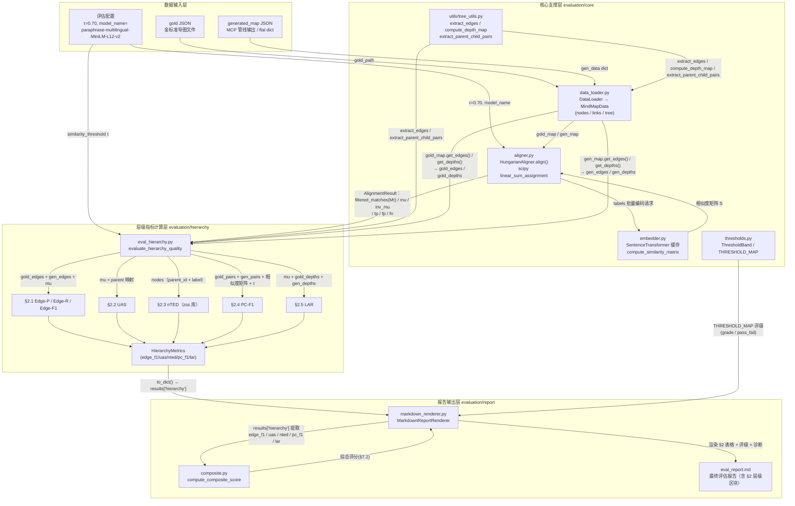

# Edge（边）／Hierarchy（层级）相关分数评估技术文档

> **适用范围**：`/home/akku/ai-mindmap-agent` 项目 `evaluation/` 评估系统
> **规范依据**：`Evaluation_Schema.md` v1.5 —— §2 层级结构正确率评估（Hierarchy Structure Accuracy）
> **覆盖指标**：Edge-P／Edge-R／Edge-F1（§2.1）、UAS（§2.2）、nTED（§2.3）、PC-F1（§2.4）、LAR（§2.5）
> **核心结论**：所有边级／层级指标（除 nTED 与 PC-F1 的少数例外）均以 §1.1 匈牙利节点对齐 `AlignmentResult` 为**共享前置依赖**，与节点标签评估使用同一套节点对应关系（`mu` / `inv_mu`），确保标签维度与层级维度评估口径一致、可复现。

---

## 目录

- [一、模块全景清单](#一模块全景清单)
  - [1.1 evaluation/ 目录归属关系](#11-evaluation-目录归属关系)
  - [1.2 参与模块总表](#12-参与模块总表)
  - [1.3 模块依赖方向](#13-模块依赖方向)
- [二、各模块职责详解](#二各模块职责详解)
  - [2.1 统一入口 run_evaluation.py](#21-统一入口-run_evaluationpy)
  - [2.2 数据加载 data_loader.py](#22-数据加载-data_loaderpy)
  - [2.3 向量嵌入 embedder.py](#23-向量嵌入-embedderpy)
  - [2.4 匈牙利节点对齐 aligner.py（所有边级／层级指标的前置依赖）](#24-匈牙利节点对齐-alignerpy所有边级层级指标的前置依赖)
  - [2.5 层级指标计算 eval_hierarchy.py（六大指标详解）](#25-层级指标计算-eval_hierarchypy六大指标详解)
  - [2.6 阈值定义与评级 thresholds.py](#26-阈值定义与评级-thresholdspy)
  - [2.7 报告生成 markdown_renderer.py（＋ composite.py）](#27-报告生成-markdown_rendererpy＋-compositepy)
  - [2.8 支撑模块 tree_utils.py 与 schema.py](#28-支撑模块-tree_utilspy-与-schemapy)
  - [2.9 执行顺序总览](#29-执行顺序总览)
- [三、Mermaid 协作与数据流图](#三mermaid-协作与数据流图)
  - [3.1 模块协作与数据流主图](#31-模块协作与数据流主图)
  - [3.2 关键参数与产物传递对照表](#32-关键参数与产物传递对照表)

---

## 一、模块全景清单

### 1.1 evaluation/ 目录归属关系

```
evaluation/
├── run_evaluation.py              # 统一入口（交互式 CLI + 批量模式 + 示例演示）
├── core/                          # ★ 核心基础设施（无业务上层依赖）
│   ├── data_loader.py             #   数据加载 + MindMapData 统一数据结构
│   ├── embedder.py                #   Embedding 模型封装 + 相似度矩阵
│   ├── aligner.py                 #   匈牙利节点对齐（共享基础设施）
│   └── thresholds.py              #   全指标阈值定义 + 评级逻辑
├── label/
│   └── eval_label.py              # §1 节点标签质量（内部调用 aligner，产出 AlignmentResult）
├── hierarchy/
│   └── eval_hierarchy.py          # ★ §2 层级结构：Edge-P/R/F1、UAS、nTED、PC-F1、LAR
├── report/
│   ├── markdown_renderer.py       # §7.3 Markdown 报告渲染
│   └── composite.py               # §7.2 综合评分（Composite Score）
├── utils/
│   ├── tree_utils.py              # 边提取、深度计算、父子对提取（Edge/Hierarchy 直接依赖）
│   ├── io_utils.py                # JSON 读写、双轨保存（session + debug_output）
│   └── console_utils.py           # CLI 交互、进度追踪、结果表格打印
├── qa/  efficiency/  multilingual/  human_correlation/
│                                   # §3/§4/§5/§6 其他维度（本文档不展开，但由同一入口编排）
└── data/                           # gold/、concepts/、sessions/、human_scores/ 等测试数据
```

### 1.2 参与模块总表

| 模块（路径） | 角色 | 对应 Schema 章节 | 与 Edge/Hierarchy 的关系 |
|---|---|---|---|
| `evaluation/run_evaluation.py` | 编排入口 | §7 全流程 | 按顺序调用加载→对齐→指标→报告；注入 τ、model_name、selected_methods |
| `evaluation/core/data_loader.py` | 数据加载 | — | 产出 `MindMapData`（nodes/links/tree），提供 `get_edges()` / `get_depths()` |
| `evaluation/core/embedder.py` | 向量嵌入 | §8.1 | 提供 Sentence-Transformer 封装与余弦相似度矩阵 |
| `evaluation/core/aligner.py` | 节点对齐 | §1.1、§8.2 | 产出 `AlignmentResult`（`mu` / `inv_mu` / `M_τ`）—— 边级指标前置依赖 |
| `evaluation/core/thresholds.py` | 阈值判定 | §7.1 | 定义 Edge-F1/UAS/nTED/PC-F1/LAR 的优良差边界，供报告评级 |
| `evaluation/hierarchy/eval_hierarchy.py` | **指标计算核心** | §2.1~§2.5 | 计算六个层级指标，产出 `HierarchyMetrics` |
| `evaluation/report/markdown_renderer.py` | 报告生成 | §7.3 | 将 `results['hierarchy']` 渲染为报告 §2 区块并评级 |
| `evaluation/report/composite.py` | 综合评分 | §7.2 | 将 Edge-F1/UAS/nTED/PC-F1 纳入综合评分 |
| `evaluation/utils/tree_utils.py` | 树结构工具 | — | `extract_edges`、`compute_depth_map`、`extract_parent_child_pairs` |
| `evaluation/label/eval_label.py` | 标签质量（协作模块） | §1.2~§1.4 | 与 hierarchy 共享同一个 `HungarianAligner` / `AlignmentResult` |
| `schema.py`（项目根） | 连线类型事实来源 | — | `LINK_TYPE_SCHEMA.hierarchical` 决定哪些连线计入层级边 |
| `utils/io_utils.py`、`utils/console_utils.py` | IO/CLI 支撑 | — | 结果持久化、进度展示（不参与指标计算） |

### 1.3 模块依赖方向

```
run_evaluation.py
   ├─→ core/data_loader.py  （DataLoader、MindMapData）
   ├─→ core/aligner.py      （HungarianAligner）
   ├─→ label/eval_label.py  （evaluate_label_quality）
   ├─→ hierarchy/eval_hierarchy.py（evaluate_hierarchy_quality）
   ├─→ report/markdown_renderer.py（MarkdownReportRenderer）
   ├─→ utils/* 、mcp_client.py、config.py
   └─→（间接）report/composite.py、core/thresholds.py

eval_hierarchy.py
   ├─→ core/aligner.py      （AlignmentResult：mu / inv_mu）
   ├─→ core/data_loader.py  （MindMapData：get_edges / get_depths）
   ├─→ core/embedder.py     （compute_similarity_matrix，PC-F1 用）
   ├─→ utils/tree_utils.py  （extract_edges / extract_parent_child_pairs / compute_depth_map）
   └─→ zss（第三方，nTED 用；缺失时 nted=None）

aligner.py → core/embedder.py → sentence_transformers（HF 模型）
data_loader.py → utils/tree_utils.py → schema.py（LINK_TYPE_SCHEMA）
markdown_renderer.py → core/thresholds.py、core/data_loader.py、report/composite.py
```

**依赖方向小结**：`utils` 与 `core` 处于底层（无互相依赖）；`hierarchy` 与 `label` 并列位于 `core` 之上，二者通过 `AlignmentResult` 共享对齐结果；`report` 与 `run_evaluation` 处于最上层，只做聚合与展示，不参与指标计算。

---

## 二、各模块职责详解

### 2.1 统一入口 run_evaluation.py

**职责**：CLI 入口与流程编排。它本身不计算任何指标，但决定 Edge/Hierarchy 评估的**执行顺序**与**参数注入**。

关键编排逻辑（`_run_evaluation_for_pair`，约 L676）：

1. `DataLoader.from_map_file(gold_path)` 加载金标准 → `gold_map`；`DataLoader.from_flat_dict(gen_data)` 加载生成图 → `gen_map`；
2. 构造共享匹配器：`aligner = HungarianAligner(model_name=model_name, threshold=threshold)`（τ 默认 **0.70**）；
3. 若选中 `label`：`evaluate_label_quality(gold_map, gen_map, aligner, essential_concepts)` —— 内部执行一次 `aligner.align()`；
4. 若选中 `hierarchy`：`alignment = aligner.align(gold_map.nodes, gen_map.nodes)` → `evaluate_hierarchy_quality(gold_map, gen_map, alignment)`，`HierarchyMetrics.to_dict()` 写入 `results['hierarchy']`；
5. 批量模式下对每次重复运行的结果取平均（`_average_eval_results`），再交给 `MarkdownReportRenderer.render(...)` 生成报告并双轨保存（`evaluation/data/sessions/{ts}/eval_report.md` 与 `evaluation/eval_report_{name}_{ts}.md`）。

> 注意：入口中 label 与 hierarchy 各自调用一次 `aligner.align()`（`AlignmentResult` 未跨函数传递），但由于 `embedder` 有进程级模型缓存，两次对齐使用同一模型与同一 τ，结果一致；设计意图上两者共享同一套对齐结果（见 2.4）。

### 2.2 数据加载 data_loader.py

**职责**：把金标准导图与生成导图加载并统一为**可计算的数据结构** `MindMapData`。

- **`MindMapData`**（`@dataclass`）：统一持有 `nodes: list[dict]`、`links: list[dict]`、`tree: list[dict]`（嵌套 G6 树）、`metadata: dict`，并提供派生视图：
  - `get_labels()` / `get_node_ids()`：标签与 ID 列表；
  - `get_edges()` → 委托 `tree_utils.extract_edges(nodes, links, tree)`，返回 `[(parent_id, child_id), ...]`（**gold_edges / gen_edges 的唯一来源**）；
  - `get_depths()` → 委托 `tree_utils.compute_depth_map`，返回 `{node_id: depth}`（LAR 的输入）；
  - `get_all_texts()`：label + details 汇总（Entity Recall 用）。
- **`DataLoader.from_map_file(filepath)`**：兼容 `{"data": {...}}` 包裹结构与扁平 `{nodes, links, tree}` 结构；`metadata` 记录 `source_file` 便于追溯实际加载的金标准。
- **`DataLoader.from_flat_dict(data)`**：直接由生成管线产出的 dict 构造（MCP 返回的 `generated_map`）。
- **`DataLoader.from_debug_output(session_ts)`**：从 `debug_output/<session_ts>/` 加载最新 JSON（调试用）。

> 边界行为：加载失败返回 `None`，入口层据此报 "Gold standard load failed / Generated map load failed"。

### 2.3 向量嵌入 embedder.py

**职责**：将节点标签编码为稠密向量并计算**语义相似度矩阵**。

- `get_embedding_model(model_name)`：**懒加载 + 进程内单例缓存**（`_model_cache` 字典），默认模型 `paraphrase-multilingual-MiniLM-L12-v2`（384 维、支持 50+ 语言，推荐 τ=0.70）。
- `compute_similarity_matrix(gold_labels, gen_labels, model_name, normalize=True)`：
  1. 空列表保护（任一为空返回零矩阵，避免 `encode([])` 崩溃）；
  2. `model.encode(..., normalize_embeddings=True)` 批量编码；
  3. 返回 `gold_embs @ gen_embs.T`，即形状 `(len(gold), len(gen))` 的**余弦相似度矩阵** \(S\)。
- `batch_similarity(queries, targets)`：Entity Recall 用的批量查询接口。

**关键点**：归一化后的内积即余弦相似度，矩阵乘法一次完成全部两两比较，是后续匈牙利匹配与 PC-F1 双矩阵判定的计算基础。

### 2.4 匈牙利节点对齐 aligner.py（所有边级／层级指标的前置依赖）

**职责**：建立金标准节点与生成节点之间的**最优一一对应关系**，是 §1 与 §2 全部指标的共享基础设施（对应 `Evaluation_Schema.md` §1.1 / §8.2）。

`HungarianAligner.align(gold_nodes, gen_nodes)` 四步流程：

1. **标签提取**：`gold_labels` / `gen_labels`（含 ID 列表，供后续映射使用）；
2. **嵌入编码**：调用 embedder 得到归一化向量，构造相似度矩阵 \(S \in [0,1]^{n_g \times n_m}\)；
3. **匈牙利最优指派**：成本矩阵 \(C(i,j) = 1 - S(i,j)\)，调用 `scipy.optimize.linear_sum_assignment` 求解全局最优匹配 \(\mathcal{M}^*\)（\(O(\max(m,n)^3)\)），保证一对一无重复；
4. **阈值过滤**：保留 \(S \geq \tau\) 的高质量匹配对，得 \(\mathcal{M}_\tau\)。

产出 **`AlignmentResult`**（dataclass，下游所有指标的输入）：

| 字段 | 含义 |
|---|---|
| `similarity_matrix` | 完整相似度矩阵（诊断用） |
| `raw_matches` | 原始匹配对 `[(gen_idx, gold_idx, sim)]`，即 \(\mathcal{M}^*\) |
| `filtered_matches` | 阈值过滤后的 \(\mathcal{M}_\tau\) |
| `threshold` / `model_name` | 本次对齐使用的 τ 与模型（传递给 PC-F1 复算相似度） |
| `tp` / `fp` / `fn` | \(|\mathcal{M}_\tau|\)、未匹配生成节点数、未匹配金标准节点数 |
| **`mu`** | `gold_id → gen_id` 映射（仅 \(\mathcal{M}_\tau\) 内节点） |
| **`inv_mu`** | 逆映射 `gen_id → gold_id` |
| `node_matches_table()` | 可读匹配明细（报告展示用） |

**为什么它是所有边级／层级指标的前置依赖**：

- **Edge-P/R/F1**：判定标准边 \((s_p, s_c)\) 是否为 TP，必须先将两端节点经 `mu` 投影到生成图节点空间，再查 `(mu[s_p], mu[s_c])` 是否在 `gen_edge_set` 中——没有对齐映射，边无法跨树比较；
- **UAS**：以"匹配节点"为分母、以 `mu` 投影后的父节点一致性为判据；
- **LAR**：在 `mu` 的每一对匹配节点上比较深度；
- **一致性保证**：`Evaluation_Schema.md` 明确规定"所有边级指标均依赖 §1.1 的匈牙利节点对齐 \(\mathcal{M}_\tau\)，确保标签评估和层级评估使用同一套节点对应关系"，因此 `eval_hierarchy` 通过参数接收 `AlignmentResult` 而非自行重新对齐。

> **例外说明**：nTED（zss 树编辑距离）按 label 直接比较树结构、PC-F1 按标签语义对直接匹配父子对，二者**不依赖** `mu`，但与 Edge-F1 形成互补校验——PC-F1 与 Edge-F1 结果越接近，说明节点对齐质量越高。

### 2.5 层级指标计算 eval_hierarchy.py（六大指标详解）

入口：`evaluate_hierarchy_quality(gold_map, gen_map, alignment, similarity_threshold=0.70) -> HierarchyMetrics`。内部先取 `mu = alignment.mu`、`inv_mu = alignment.inv_mu`，再统一提取：

```python
gold_edges = gold_map.get_edges()      # 金标准边集 E_s
gen_edges  = gen_map.get_edges()       # 生成边集 E_g
```

#### 2.5.1 Edge-P / Edge-R / Edge-F1（§2.1）

- **输入依赖**：`gold_edges`、`gen_edges`、`mu`。
- **计算逻辑**：遍历金标准边 \((parent, child)\)，若 `parent ∈ mu` 且 `child ∈ mu`，且投影后的 `(mu[parent], mu[child]) ∈ gen_edge_set`，则计为 TP：
  \[
  \text{TP}_{edge} = |\{(s_p, s_c) \in E_s \mid \mu(s_p) \neq \bot,\ \mu(s_c) \neq \bot,\ (\mu(s_p), \mu(s_c)) \in E_g\}|
  \]
- **公式**：
  \[
  \text{FN}_{edge} = |E_s| - \text{TP}_{edge},\quad \text{FP}_{edge} = |E_g| - \text{TP}_{edge}
  \]
  \[
  \text{Edge-P} = \frac{\text{TP}_{edge}}{|E_g|},\quad
  \text{Edge-R} = \frac{\text{TP}_{edge}}{|E_s|},\quad
  \text{Edge-F1} = \frac{2 \times \text{Edge-P} \times \text{Edge-R}}{\text{Edge-P} + \text{Edge-R}}
  \]
- **边界情况**：`|E_s|=0` 时 Edge-R 定义为 1.0；`|E_g|=0` 时 Edge-P 定义为 1.0；P+R=0 时 F1 为 0.0。
- **含义**：以"边"为计数单位惩罚缺失边（FN）与多余边（FP），是最核心的层级一致性指标。

#### 2.5.2 UAS — 无标签依存得分（§2.2）

- **输入依赖**：`mu`（分母 = 匹配节点数）、由两边集构建的 `gold_parent` / `gen_parent`（`child_id → parent_id`）。
- **计算逻辑**：对 `mu` 中每一对 `(gold_id, gen_id)`：
  - 双方均无父（即不在 parent 映射中，视为根）→ 正确；
  - 双方均有父，且 `mu[gold_parent[gold_id]] == gen_parent[gen_id]` → 正确；
  - 其余情况（金标准有父但生成侧无父，或投影父不一致）→ 错误。
- **公式**：
  \[
  \text{UAS} = \frac{|\{s \in V_s \mid \mu(s) \neq \bot \land \text{parent}_g(\mu(s)) = \mu(\text{parent}_s(s))\}|}{|\mathcal{M}_\tau|}
  \]
- **边界情况**：`mu` 为空时显式返回 **0.0**（而非误导性的 1.0），并打 warning 日志。
- **与 Edge-R 的对比**：Edge-R 以边为单位（分母 \(|E_s|\)，未匹配节点对应的边直接算 FN）；UAS 以节点为单位（分母 \(|\mathcal{M}_\tau|\)），只统计已成功匹配的节点，对标签失败的容忍度更高。

#### 2.5.3 nTED — 归一化树编辑距离（§2.3）

- **输入依赖**：`gold_map.nodes`、`gen_map.nodes` 的 `parent_id` 与 `label`；第三方库 `zss`（Zhang-Shasha 算法）。
- **计算逻辑**（`_compute_nted`）：
  1. 按 `parent_id` 递归构建 zss 树（子节点按 label 字典序排序，保证确定性）；树构建失败返回 `(1.0, 1.0)` 最大距离；
  2. `raw_ted = zss.simple_distance(gold_tree, gen_tree)`，即最小编辑操作数（插入/删除/重标记）；
  3. 归一化：
  \[
  \text{nTED} = \frac{\text{TED}(T_g, T_s)}{\max(|T_g|, |T_s|)}
  \]
- **降级行为**：`zss` 未安装（`requirements.txt` 未声明）或计算异常时，`nted = None` 并记录 warning；报告层显示 "N/A (zss not installed)"，且 nTED 不计入综合评分（composite 会跳过 None）。
- **含义**：度量两棵树整体结构差异，越小越好；由于分母为节点数较大值，nTED 可能低估悬殊规模树的结构差异，需与 Edge-P/R/F1、UAS 综合判断。

#### 2.5.4 PC-F1 — 父子关系 F1（§2.4）

- **输入依赖**：`extract_parent_child_pairs` 提取的 `gold_pairs` / `gen_pairs`（`(parent_label, child_label, parent_id, child_id)` 四元组）；`compute_similarity_matrix`；τ（即 `similarity_threshold`，与对齐阈值一致）。
- **计算逻辑**（不依赖 `mu`，纯标签语义比对）：
  1. 分别取父标签列表与子标签列表；
  2. 计算**父-父相似度矩阵** `parent_S` 与**子-子相似度矩阵** `child_S`；
  3. 对每条金标准父子对，在生成父子对中寻找**未被使用**的一对，要求 `parent_S[i,j] ≥ τ` **且** `child_S[i,j] ≥ τ` 才计为命中（一对一贪心匹配，避免重复计数）。
- **公式**：
  \[
  \text{PC-R} = \frac{\text{correct}}{\text{gold\_pairs}},\quad
  \text{PC-P} = \frac{\text{correct}}{\text{gen\_pairs}},\quad
  \text{PC-F1} = \frac{2 \times \text{PC-P} \times \text{PC-R}}{\text{PC-P} + \text{PC-R}}
  \]
- **与 Edge-F1 的互补关系**：Edge-F1 走节点映射（对齐视角），PC-F1 走标签语义（标签视角）；两者越接近 → 对齐质量越高。

#### 2.5.5 LAR — 层级对齐率（§2.5）

- **输入依赖**：`gold_map.get_depths()` / `gen_map.get_depths()`（`compute_depth_map`，根深度=0，parent_id → links → tree 三级兜底，带防环保护）、`mu`。
- **计算逻辑**：对 `mu` 每一对匹配节点比较深度是否相等。
- **公式**：
  \[
  \text{LAR} = \frac{|\{(g, s) \in \mathcal{M}_\tau \mid \text{depth}(g) = \text{depth}(s)\}|}{|\mathcal{M}_\tau|}
  \]
- **边界情况**：`mu` 为空时同样显式返回 0.0。
- **含义**：衡量匹配节点所在层级（抽象程度）是否一致，值越高说明导图保持了金标准的层级规划。

#### HierarchyMetrics 输出

`evaluate_hierarchy_quality` 返回 `HierarchyMetrics` dataclass（`edge_precision/recall/f1`、`edge_tp/fp/fn`、`uas`、`nted`、`raw_ted`、`pc_precision/recall/f1`、`pc_tp`、`lar`），`to_dict()` 四舍五入到 4 位小数后写入 `results['hierarchy']`，供报告渲染与批量平均使用。

### 2.6 阈值定义与评级 thresholds.py

**职责**：集中定义所有指标的"优秀/良好/需改进"边界，提供统一评级入口（对应 `Evaluation_Schema.md` §7.1）。

- **`Grade` 枚举**：`EXCELLENT`（🏆 优秀）、`GOOD`（👍 良好）、`NEEDS_IMPROVEMENT`（⚠️ 需改进）。
- **`ThresholdBand(excellent, good, higher_is_better=True)`**：
  - `grade(value)`：`higher_is_better=True` 时按 `≥ excellent → 优秀；≥ good → 良好；否则需改进`；`higher_is_better=False`（如 nTED）反向比较（`≤`）；
  - `pass_fail(value)`：优秀/良好 → `✅ PASS`，需改进 → `❌ FAIL`。

**§2 层级指标阈值表**（`thresholds.py` 实际实现值，与 Schema §2 对齐并补齐"良好"档）：

| 指标 | 优秀 Excellent | 良好 Good | 需改进 Needs Improvement | 方向 |
|---|---|---|---|---|
| Edge-F1 | ≥ 0.80 | 0.65 – 0.79 | < 0.65 | 越高越好 |
| UAS | ≥ 0.85 | 0.70 – 0.84 | < 0.70 | 越高越好 |
| nTED | ≤ 0.25 | ≤ 0.40 | > 0.40 | **越低越好** |
| PC-F1 | ≥ 0.75 | 0.60 – 0.74 | < 0.60 | 越高越好 |
| LAR | ≥ 0.70 | 0.50 – 0.69 | < 0.50 | 越高越好 |

- **`THRESHOLD_MAP`**：按指标名（`edge_f1`、`uas`、`nted`、`pc_f1`、`lar` 等）索引的速查字典，报告渲染器据此逐指标评级与显示阈值字符串（如 `≥ 0.80` / `≤ 0.25`）。

### 2.7 报告生成 markdown_renderer.py（＋ composite.py）

**职责**：将各维度 `results` 渲染为符合 `Evaluation_Schema.md` §7.3 模板的 Markdown 报告。

- `MarkdownReportRenderer(embedding_model, threshold).render(gold_map, gen_map, results, inclusion_list, config_info, example_mode)`：依次渲染头部（含模型与 τ 信息）→ 摘要 → §1 标签 → **§2 层级** → §3 QA → §4 效率 → §5 多语言 → §6 人工对齐 → §7 综合评分 → §8 诊断建议 → 页脚；
- `_render_hierarchy_section`：对 `results['hierarchy']` 逐指标查 `THRESHOLD_MAP` 生成 `Value / Threshold / Grade / Status` 四列表格；nTED 单独处理"越低越好"与 `None`（zss 未安装）情形；补充 Edge 明细（金标准边数、生成边数、TP/FP/FN）；
- 阈值判定的实际执行者是 `ThresholdBand.grade()/pass_fail()`——**渲染器只做展示，不做计算**；
- `composite.py` 的 `compute_composite_score` 将 `edge_f1`(0.15)、`(1-nted)`(0.15)、`uas`(0.10)、`pc_f1`(0.10) 等加权汇总为 §7.2 综合评分，缺失维度剔除后按已用权重归一化；
- `_render_diagnostics`：根据 Edge-F1、UAS、nTED 的值自动给出改进建议（如 "Edge-F1 需改进 → 检查层级规划阶段父子关系"）。

### 2.8 支撑模块 tree_utils.py 与 schema.py

**`utils/tree_utils.py`**（Edge/Hierarchy 的直接数据源）：

- `extract_edges(nodes, links, tree)`：提取 `[(parent_id, child_id)]`，优先级 **嵌套 tree → nodes.parent_id → links** 三级兜底，覆盖 flatten 后丢失 `parent_id` 的节点；links 中仅 `HIERARCHY_LINK_TYPES` 计入边，非层级连线（如 reference）仅在其 target 尚无父节点时提升为边；
- `compute_depth_map(nodes, links, tree)`：计算每节点深度（根=0），parent_id → links → tree 三级补全，迭代 + 路径内防环保护（防止 `parent_id` 成环死循环）；
- `extract_parent_child_pairs(nodes, links)`：产出 `(parent_label, child_label, parent_id, child_id)`，供 PC-F1 使用；
- `nested_to_flat`：G6 嵌套树转扁平 nodes/links（生成侧数据归一化）。

**`schema.py`（项目根）**：`LINK_TYPE_SCHEMA` 是前后端共享的**连线类型单一事实来源**；`hierarchical=True` 的类型（solid 父子关系、dashed 间接关联、containment 包含）计入层级边，直接影响 Edge-F1/UAS 的边集构成；`tree_utils` 通过 import 派生 `HIERARCHY_LINK_TYPES`（import 失败时回退硬编码元组），杜绝各模块硬编码不一致。

### 2.9 执行顺序总览

```
数据加载 → 嵌入/对齐 → 层级指标计算 → 阈值评级 → 报告输出
 ① DataLoader.from_map_file / from_flat_dict        （data_loader.py）
 ② HungarianAligner.align()                          （embedder.py → aligner.py）
 ③ evaluate_hierarchy_quality(gold_map, gen_map, alignment, τ)
    ├─ Edge-P/R/F1   （依赖 mu + gold_edges/gen_edges）
    ├─ UAS           （依赖 mu + 双向 parent 映射）
    ├─ nTED          （依赖 nodes，zss 库）
    ├─ PC-F1         （依赖标签相似度矩阵 + τ）
    └─ LAR           （依赖 mu + 双树 depth map）
 ④ ThresholdBand.grade/pass_fail                     （thresholds.py）
 ⑤ MarkdownReportRenderer.render → eval_report.md    （markdown_renderer.py + composite.py）
```

---

## 三、Mermaid 协作与数据流图

### 3.1 模块协作与数据流主图



### 3.2 关键参数与产物传递对照表

| 关键参数 / 产物 | 类型 | 产生模块 → 消费模块 | 说明 |
|---|---|---|---|
| `τ`（语义相似度阈值） | `float = 0.70` | 入口配置 → `HungarianAligner` → `AlignmentResult.threshold` → `eval_hierarchy` | ① 过滤匈牙利匹配对（\(\mathcal{M}^* \to \mathcal{M}_\tau\)）；② PC-F1 的父/子标签命中判定；③ 报告头部展示 |
| `model_name` | `str` | 入口配置 → `HungarianAligner` / `embedder` → `AlignmentResult.model_name` → PC-F1 复算相似度 | 保证对齐与 PC-F1 使用同一 embedding 模型 |
| `mu` / `inv_mu` | `dict[str, str]` | `AlignmentResult`（aligner.py）→ `eval_hierarchy` | `gold_id↔gen_id` 双向投影映射；Edge-TP 判定、UAS、LAR 的公共分母与投影依据 |
| `gold_edges` / `gen_edges` | `list[tuple[str,str]]` | `MindMapData.get_edges()`（data_loader → tree_utils）→ `eval_hierarchy` | Edge-P/R/F1 的分子分母、UAS 的 parent 映射来源 |
| `gold_depths` / `gen_depths` | `dict[str, int]` | `MindMapData.get_depths()`（data_loader → tree_utils）→ `eval_hierarchy` | LAR 深度比较输入 |
| `gold_pairs` / `gen_pairs` | `list[tuple]` | `extract_parent_child_pairs`（tree_utils）→ `eval_hierarchy` | PC-F1 标签级父子对匹配 |
| `HierarchyMetrics` | dataclass | `eval_hierarchy.evaluate_hierarchy_quality` → `to_dict()` → `results['hierarchy']` | 六个层级指标的唯一出口，供渲染、批量平均、诊断 |
| `THRESHOLD_MAP` | `dict[str, ThresholdBand]` | `thresholds.py` → `markdown_renderer` | 逐指标评级（优秀/良好/需改进）与 PASS/FAIL 判定 |
| 最终评估报告 | `str`（Markdown） | `MarkdownReportRenderer.render` → 双轨落盘 | `evaluation/data/sessions/{ts}/{pair}/eval_report.md` ＋ `evaluation/eval_report_{pair}_{ts}.md` |
| `zss`（第三方） | 库 | `eval_hierarchy._compute_nted` | 缺失时 `nted=None`，报告显示 N/A，综合评分跳过该项 |

---

*文档生成说明：以上内容基于 `evaluation/` 目录实际代码（`run_evaluation.py`、`core/`、`hierarchy/eval_hierarchy.py`、`report/`、`utils/tree_utils.py`）与 `Evaluation_Schema.md` v1.5 整理，公式记号与规范文档 §2 保持一致。*
