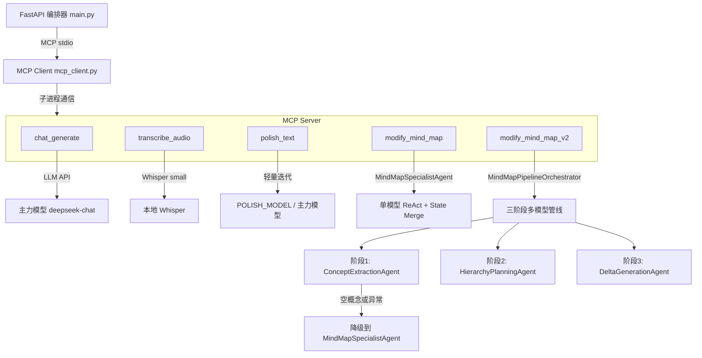
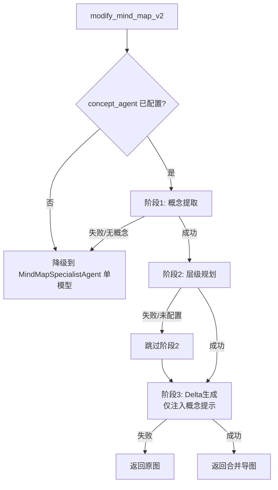
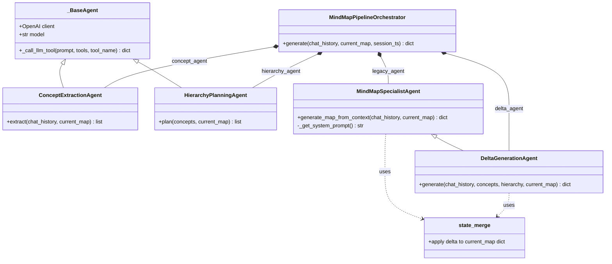

# MCP 服务器体系完整报告

> 报告日期：2026-06-21
> 项目根目录：`/home/akku/ai-mindmap-agent`

---

## 1. MCP 服务器整体概览

项目中仅存在 **一个** MCP 服务器实例，名称为 **`mindmap-mcp-server`**，定义于 [`mcp_server.py`](file:///home/akku/ai-mindmap-agent/mcp_server.py)。

### 1.1 服务器基本信息

| 属性 | 值 |
|---|---|
| 服务器名称 | `mindmap-mcp-server` |
| 底层框架 | `mcp.server.fastmcp.FastMCP` |
| 传输协议 | `stdio`（标准输入/输出） |
| 启动模式 | `mcp.run(transport="stdio")` |
| 日志通道 | `stderr`（避免污染 stdio 通道） |

### 1.2 暴露的所有 MCP 工具

通过 `@mcp.tool()` 注册的工具共 **4 个**：

| # | 工具函数名 | 功能 | 所属流程环节 |
|---|---|---|---|
| 0 | [`chat_generate`](#21-工具-0-chat_generate) | LLM 对话生成 | 聊天回复 |
| 1 | [`transcribe_audio`](#22-工具-1-transcribe_audio) | Whisper 音频转录 | 语音输入处理 |
| 2 | [`polish_text`](#23-工具-2-polish_text) | 文本润色（混合审查模式） | 转录文本后处理 |
| 3 | [`modify_mind_map`](#24-工具-3-modify_mind_map) | 单模型增量绘图（ReAct + State Merge） | 思维导图增量修改 |
| 4 | [`modify_mind_map_v2`](#25-工具-4-modify_mind_map_v2) | 多模型协作增量绘图（三阶段管线） | 思维导图增量修改（增强版） |

> **注意**：`chat_generate` 并非「未完整显示」，它完整定义在第 184～212 行，是一个标准 MCP 工具。

### 1.3 整体架构数据流



---

## 2. 每个 MCP 工具的详细分析

### 2.1 工具 0: `chat_generate`

#### 功能描述

纯 LLM 对话生成工具。接收 OpenAI 格式的完整 `messages` 列表（含 system prompt 和历史），返回 AI 回复文本。在应用流程中充当 **聊天引擎**，负责回答用户问题、提供解释和建议。

#### 实现原理

```python
@mcp.tool()
def chat_generate(messages: list) -> dict:
    response = llm_client.chat.completions.create(
        model=Config.LLM_MODEL,
        messages=messages
    )
    reply_text = response.choices[0].message.content
    return {"reply_text": reply_text}
```

- 直接调用全局 `llm_client`（OpenAI 兼容客户端）的 `chat.completions.create`。
- 不涉及任何 `mindmap_agent.py` 中的类。
- 调用层在 `main.py` 中被编排到 `/chat` 接口的阶段一，由 `_call_tool_with_retry` 封装带验证和重试。

#### 备用/降级机制

无内部降级。异常由 `main.py` 的 `_validate_chat_reply` 捕获，失败后返回预定义错误消息，最多重试 1 次。

#### 配置依赖

| 环境变量 | 默认值 | 说明 |
|---|---|---|
| `LLM_API_KEY` | `DEEPSEEK_API_KEY` 或空 | API 密钥 |
| `LLM_BASE_URL` | `https://api.deepseek.com` | API 端点 |
| `LLM_MODEL` | `deepseek-chat` | 模型名称 |

---

### 2.2 工具 1: `transcribe_audio`

#### 功能描述

使用本地 Whisper small 模型将音频文件转录为文本，自动检测语言。在应用流程中处于 **语音输入处理** 环节，是音频上传管线的第一步。

#### 实现原理

```python
@mcp.tool()
def transcribe_audio(file_path: str) -> dict:
    result = whisper_model.transcribe(file_path)
    raw_text = result["text"].strip()
    detected_language = result.get("language", "en")
    return {"raw_text": raw_text, "detected_language": detected_language}
```

- 全局 `whisper_model` 启动时通过 `whisper.load_model("small")` 加载一次。
- 不涉及 `mindmap_agent.py`。

#### 备用/降级机制

无内部降级。调用方 `main.py` 的 `_validate_transcribe` 检查返回是否为 dict，失败返回 `{"raw_text": "", "detected_language": "en"}`。

#### 配置依赖

无环境变量依赖。Whisper small 模型始终加载。

---

### 2.3 工具 2: `polish_text`

#### 功能描述

对 STT 转录文本进行润色修复（错别字、标点、语气词去除）。支持 **混合审查模式**（`polish_client` 存在时），包含两个阶段：
- 阶段一：轻量模型迭代润色 + 自审查收敛
- 阶段二：主力模型终审（ACCEPT / FIX / REJECT）

在应用流程中处于 **音频上传管线的第二步**（转录 → 润色 → 返回前端）。

#### 实现原理

**路径 A：主力模型直接润色**（未配置 `POLISH_MODEL`）

```python
if polish_client is None:
    return _polish_direct(client=llm_client, model=Config.LLM_MODEL, ...)
```

**路径 B：混合审查模式**（配置了 `POLISH_MODEL`）

```
阶段一（轻量迭代）：
    for i in range(Config.POLISH_ITERATIONS):
        candidate = _polish_direct(polish_client, POLISH_MODEL, candidate, ...)
        edit_ratio = _edit_distance_ratio(prev, candidate)
        if edit_ratio < 0.05 → 收敛，提前终止

阶段二（主力终审）：
    verdict = _judge_by_main_model(llm_client, LLM_MODEL, raw_text, candidate, ...)
    if ACCEPT → 返回 candidate
    if FIX   → 返回 verdict.fixed_text
    if REJECT → 降级返回 raw_text + 告警
```

关键辅助函数：

| 函数 | 作用 |
|---|---|
| `_polish_direct` | 单次润色调用，temperature=0.2 |
| `_edit_distance_ratio` | 简易 Levenshtein 归一化编辑距离，判定收敛 |
| `_judge_by_main_model` | 主力模型终审裁决，temperature=0.0，max_tokens=1024 |
| `_get_polish_prompt` | 根据语言返回润色 system prompt |

#### 调试输出

通过 `write_debug_file` 写入调试目录，输出文件包括：
- `polish_iteration_{n}.txt` — 每次迭代的文本对比
- `polish_final_summary.json` — 终审摘要（含裁决、迭代次数、编辑距离等）

#### 备用/降级机制

| 异常场景 | 行为 |
|---|---|
| 终审返回无法解析的文本 | 安全降级为 `ACCEPT` |
| 终审 LLM 调用异常 | 降级为 `ACCEPT` |
| 终审裁决 `REJECT` | 返回原始文本，`confidence: "low"` |
| 调试文件写入失败 | 仅日志警告，不中断流程 |

#### 配置依赖

| 环境变量 | 默认值 | 说明 |
|---|---|---|
| `POLISH_MODEL` | `None`（使用主力模型） | 轻量润色模型名称 |
| `POLISH_BASE_URL` | `LLM_BASE_URL` | 轻量模型端点 |
| `POLISH_API_KEY` | `LLM_API_KEY` | 轻量模型密钥 |
| `POLISH_ITERATIONS` | `3` | 轻量模型自迭代次数（1~5） |

---

### 2.4 工具 3: `modify_mind_map`

#### 功能描述

**单模型增量思维导图修改工具**。根据对话上下文，通过 LLM function calling 生成增量 delta（增/删/改指令），在后端执行 State Merge 合并到当前导图。在应用流程中作为 **多模型管线降级兜底**，也可独立使用。

#### 实现原理

```python
@mcp.tool()
def modify_mind_map(chat_history: str, current_map: dict) -> dict:
    updated_map = map_agent.generate_map_from_context(
        chat_history=chat_history, current_map=current_map
    )
    return updated_map
```

内部调用链：

```
modify_mind_map
  └── MindMapSpecialistAgent.generate_map_from_context()
        ├── 构建 ReAct 式 prompt（当前导图全量状态 + 对话上下文）
        ├── 调用 LLM function calling，强制 use tool "modify_mind_map"
        ├── 解析返回的 JSON delta
        └── state_merge(delta, current_map) → 返回合并后的导图
```

**`state_merge` 函数**（定义于 `mindmap_agent.py` 第 22～56 行）：

```python
def state_merge(delta: dict, current_map: dict) -> dict:
    # 4 种操作：
    # add_nodes     → 添加新节点到 nodes_dict
    # update_nodes  → 将 append_details 追加到已有节点
    # add_links     → 添加新连线（去重）
    # delete_nodes  → 删除节点及其关联连线
```

**`MindMapSpecialistAgent` 的核心设计原则**（system prompt 中定义）：

1. **绝对服从用户** — 用户输入具有最高权威
2. **禁止元节点** — AI 的分析逻辑不能创建为独立节点
3. **Details 层次化补充** — 根据 `DETAILS_ENRICHMENT_ENABLED` 决定 AI 回复内容是否进入 details
4. **原子化标签** — label ≤2 个词，严禁完整句子
5. **关联更新与层级隔离** — 创建子节点时同步更新父节点 details，禁止向上追溯
6. **语言一致** — label 和 details 必须与用户输入语言完全一致

#### 备用/降级机制

| 异常场景 | 行为 |
|---|---|
| LLM function calling 异常 | 返回 `current_map`（原图不变） |
| JSON 解析失败 | 返回 `current_map` |

#### 配置依赖

| 环境变量 | 默认值 | 说明 |
|---|---|---|
| `LLM_API_KEY` | `DEEPSEEK_API_KEY` | API 密钥 |
| `LLM_BASE_URL` | `https://api.deepseek.com` | API 端点 |
| `LLM_MODEL` | `deepseek-chat` | 模型名称 |
| `DETAILS_ENRICHMENT_ENABLED` | `true` | 是否启用 details 层次化增强 |

---

### 2.5 工具 4: `modify_mind_map_v2`

#### 功能描述

**多模型协作增量导图修改工具**（v2 管线）。内部通过三阶段 Agent 管线提升层级结构清晰度：
- 阶段 1：概念提取（轻量模型）
- 阶段 2：层级规划（中等模型）
- 阶段 3：Delta 生成（主力模型）

在应用流程中为 **`/chat` 接口的默认绘图工具**，由 `main.py` 编排器调度。

#### 实现原理

```python
@mcp.tool()
def modify_mind_map_v2(chat_history, current_map, session_ts=None):
    updated_map = map_pipeline.generate(
        chat_history=chat_history, current_map=current_map,
        session_ts=session_ts
    )
    return updated_map
```

**三阶段管线详细逻辑**（`MindMapPipelineOrchestrator.generate`）：

```
generate()
  │
  ├── 初始化 DebugOutputManager
  │
  ├── 检查 concept_agent 是否为 None
  │   └── 是 → 直接降级调用 legacy_agent (MindMapSpecialistAgent) 并返回
  │
  ├── 阶段1: ConceptExtractionAgent.extract()
  │   ├── 构建去重 prompt（排除已有节点）
  │   ├── 调用 LLM function calling，use tool "extract_concepts"
  │   ├── _validate_concepts() 过滤无效条目（空ID/空label/已存在）
  │   ├── 无概念 → 降级到 legacy
  │   └── 异常 → 降级到 legacy
  │
  ├── 阶段2: HierarchyPlanningAgent.plan()
  │   ├── 检查 hierarchy_agent 是否为 None
  │   ├── 构建层级规划 prompt
  │   ├── 调用 LLM function calling，use tool "plan_hierarchy"
  │   ├── _validate_hierarchy() 验证引用的 ID 均存在
  │   └── 异常 → 跳过阶段2（hierarchy=None），继续阶段3
  │
  └── 阶段3: DeltaGenerationAgent.generate()
      ├── 构建增强版 ReAct prompt（注入概念 + 层级规划提示）
      ├── 调用 LLM function calling，use tool "modify_mind_map"
      ├── state_merge(delta, current_map) → 合并
      ├── 异常 → 返回原图
      └── 返回最终导图
```

**降级链路总图**：



#### 调试输出

管线中的 `DebugOutputManager` 按固定编号保存中间结果：

| 文件名 | 内容 |
|---|---|
| `00_environment.txt` | 模型配置元信息 |
| `01_concept_extraction_input.txt` | 阶段1 输入（对话 + 当前导图） |
| `01_concept_extraction_output.json` | 阶段1 输出（raw + validated） |
| `02_hierarchy_planning_input.txt` | 阶段2 输入（新概念 + 现有节点） |
| `02_hierarchy_planning_output.json` | 阶段2 输出（raw + validated） |
| `03_delta_generation_input.txt` | 阶段3 输入（概念 + 层级 + 对话 + 导图） |
| `03_delta_generation_output.json` | 阶段3 原始 delta 统计 |
| `04_final_map.json` | 最终导图 |
| `05_pipeline_log.txt` | 管线执行日志 |

#### 备用/降级机制

| 异常场景 | 降级行为 |
|---|---|
| `concept_agent == None`（未配置 `CONCEPT_MODEL`） | 直接调用 `legacy_agent` 单模型 |
| 阶段1 异常 | 降级到 `legacy_agent` 单模型 |
| 阶段1 提取到 0 个新概念 | 降级到 `legacy_agent` 单模型（未发现新概念） |
| 阶段2 异常 | 跳过阶段2，阶段3 仅接收概念提示 |
| `hierarchy_agent == None`（未配置 `HIERARCHY_MODEL`） | 跳过阶段2 |
| 阶段3 异常 | 返回 `current_map` 原图不变 |

#### 配置依赖

| 环境变量 | 默认值 | 说明 |
|---|---|---|
| `CONCEPT_MODEL` | `None`（使用 `LLM_MODEL`） | 阶段1 概念提取模型 |
| `CONCEPT_BASE_URL` | `LLM_BASE_URL` | 阶段1 端点 |
| `CONCEPT_API_KEY` | `LLM_API_KEY` | 阶段1 密钥 |
| `HIERARCHY_MODEL` | `None`（使用 `LLM_MODEL`） | 阶段2 层级规划模型 |
| `HIERARCHY_BASE_URL` | `LLM_BASE_URL` | 阶段2 端点 |
| `HIERARCHY_API_KEY` | `LLM_API_KEY` | 阶段2 密钥 |
| `DELTA_MODEL` | `LLM_MODEL` | 阶段3 Delta 生成模型 |
| `DELTA_BASE_URL` | `LLM_BASE_URL` | 阶段3 端点 |
| `DELTA_API_KEY` | `LLM_API_KEY` | 阶段3 密钥 |
| `DEBUG_OUTPUT_ENABLED` | `true` | 是否启用调试输出 |
| `DEBUG_OUTPUT_DIR` | `./debug_output` | 调试文件根目录 |

---

## 3. 内部 Agent 架构解析

### 3.1 类层次结构



### 3.2 各 Agent 详表

| Agent 类 | 管线阶段 | 所属 MCP 工具 | 模型配置 | function calling 工具 | 输出 |
|---|---|---|---|---|---|
| `MindMapSpecialistAgent` | 单模型兜底（无阶段） | `modify_mind_map`、管线降级 | `LLM_MODEL` | `get_mindmap_tools()` → `modify_mind_map` | 合并后导图 dict |
| `ConceptExtractionAgent` | 阶段1：概念提取 | `modify_mind_map_v2` | `CONCEPT_MODEL` → `LLM_MODEL` | `get_concept_extraction_tools()` → `extract_concepts` | 概念列表 `[{"id","label","details","color"}]` |
| `HierarchyPlanningAgent` | 阶段2：层级规划 | `modify_mind_map_v2` | `HIERARCHY_MODEL` → `LLM_MODEL` | `get_hierarchy_planning_tools()` → `plan_hierarchy` | 关系列表 `[{"parent_id","child_id","type"}]` |
| `DeltaGenerationAgent` | 阶段3：Delta 生成 | `modify_mind_map_v2` | `DELTA_MODEL` → `LLM_MODEL` | `get_mindmap_tools()` → `modify_mind_map` | `{"delta": {...}, "merged_map": {...}}` |
| `MindMapPipelineOrchestrator` | 管线编排（非 Agent） | `modify_mind_map_v2` | 组合上述三者 | 无 | 最终导图 dict |

### 3.3 关键设计原则

#### 1. State Merge（状态合并）

所有增量修改的合并逻辑统一由独立函数 `state_merge()` 处理，**单模型**和**管线**两种模式共用同一函数。支持四种操作：
- `add_nodes` — 新增节点（按 ID 去重）
- `update_nodes` — `append_details` 追加到已有节点
- `add_links` — 新增连线（按 source+target 去重）
- `delete_nodes` — 删除节点及其连线

#### 2. 原子化标签规则

所有 Agent 的 system prompt 中统一规定：
- 节点 `label` 必须是精简的核心名词或短语，**最多 2 个词**
- 严禁使用完整句子作为 label
- 所有解释性、描述性内容放入 `details` 数组

#### 3. 层级隔离原则

关联更新机制中明确定义 **禁止向上追溯原则**：
- 创建子节点 B 时，只更新直接父节点 A 的 details
- 禁止将细节跨层级更新到 A 的父节点、祖父节点等更上层级

#### 4. 按任务特征解耦 LLM 模型配置

| 任务 | 推荐模型规模 | 配置变量 |
|---|---|---|
| 概念提取（阶段1） | 轻量（如 qwen2.5:1.5b） | `CONCEPT_MODEL` |
| 层级规划（阶段2） | 中等 | `HIERARCHY_MODEL` |
| Delta 生成（阶段3） | 主力（如 deepseek-chat） | `DELTA_MODEL` |
| 文本润色迭代 | 轻量（如 deepseek-lite） | `POLISH_MODEL` |
| 文本润色终审 / 聊天 | 主力 | `LLM_MODEL` |

所有模型均可独立配置端点（`BASE_URL`）和密钥（`API_KEY`），未配置时自动回退到主力模型。

#### 5. 内部管线模式（非嵌套 MCP）

根据项目架构规范，多模型协作采用 **内部管线模式**：
- 在单个 MCP 工具 `modify_mind_map_v2` 内部，通过普通 Python 函数调用组合三个专用 Agent
- 不进行 MCP 协议层面的嵌套调用
- `main.py` 作为唯一的编排器

#### 6. 验证层双保险

- **Agent 内部验证**：`MindMapPipelineOrchestrator` 的 `_validate_concepts()` 和 `_validate_hierarchy()` 验证 LLM 输出的结构完整性
- **编排器验证**：`main.py` 的 `_validate_map()` 验证 MCP 工具返回值结构

---

## 4. 附录

### 4.1 配置参考速查表

| 环境变量 | 默认值 | 影响范围 |
|---|---|---|
| `LLM_API_KEY` | `DEEPSEEK_API_KEY` | 主力模型、所有未配置专用 key 的模型 |
| `LLM_BASE_URL` | `https://api.deepseek.com` | 同上 |
| `LLM_MODEL` | `deepseek-chat` | 同上，以及各阶段未配置时的回退模型 |
| `POLISH_MODEL` | `None` | 润色轻量迭代模型 |
| `POLISH_ITERATIONS` | `3` | 润色自迭代次数 |
| `CONCEPT_MODEL` | `None` | 概念提取 Agent 模型 |
| `HIERARCHY_MODEL` | `None` | 层级规划 Agent 模型 |
| `DELTA_MODEL` | `LLM_MODEL` | Delta 生成 Agent 模型 |
| `DEBUG_OUTPUT_ENABLED` | `true` | 调试输出开关 |
| `DEBUG_OUTPUT_DIR` | `./debug_output` | 调试文件根目录 |
| `DETAILS_ENRICHMENT_ENABLED` | `true` | AI 回复内容是否融入节点 details |

### 4.2 关键文件一览

| 文件 | 职责 |
|---|---|
| `mcp_server.py` | MCP 服务器入口，定义 4 个 MCP 工具，初始化所有全局模型与 Agent |
| `mindmap_agent.py` | 定义所有 Agent 类（5 个）、State Merge、调试输出管理器 |
| `tools.py` | 定义 LLM function calling 的 JSON Schema 工具（3 套） |
| `config.py` | 配置管理，支持多提供商动态切换 |
| `main.py` | FastAPI 编排器，调度 MCP 工具链，维护会话记忆 |
| `mcp_client.py` | MCP Client 封装，管理子进程 stdio 通信 |
| `schema.py` | Pydantic 数据模型（Node, Link, MindMapData） |

### 4.3 启动与运行

```bash
# 安装依赖
pip install -r requirements.txt

# 启动 FastAPI 服务（自动启动 MCP Server 子进程）
python main.py
# 默认监听 http://0.0.0.0:8000
```

MCP Server 以子进程形式由 `MCPMindMapClient` 自动管理，无需手动启动。
