# 三元组对比报告

> **说明 / Note**: 每个音频包含一个三元组 — **STT 转录结果** → **Agent 生成 JSON 导图** → **人类标注 JSON 导图**（来源 GTC/YQL 择优）。
> **Report generated / 报告生成时间**: 2026-08-18 13:18:55
> **Session / 会话**: 20260818_131651
> **Audio count / 音频数量**: 9

---

## 1. Saarland University 1

### STT 转录结果 / STT Transcript

> What kinds of features or tools do you usually find most helpful in such apps? I think the explanation part will be very important to me. The electronic dictionaries can provide me some detailed definitions to a word. I can look it up like it is masculine or feminine or something else. Some of the dictionaries can also go online to some encyclopedias to find some more definitions or synonyms to it. That will be more helpful for me to learn not only the word but also the word groups that are related to each other. I can memorize very more words at the same time without having only focusing on one word.

### Agent 生成 JSON 导图 / Agent-Generated JSON Tree

**节点数 / Node count**: 7

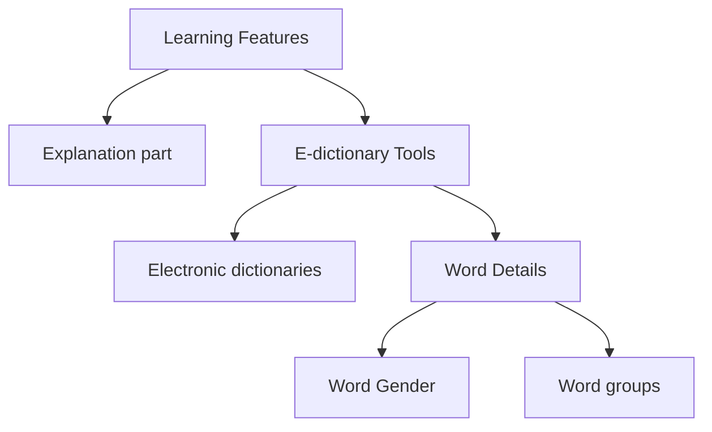

### 人类标注 JSON 导图 / Human-Annotated JSON Tree（来源 / Source: YQL）

**节点数 / Node count**: 10

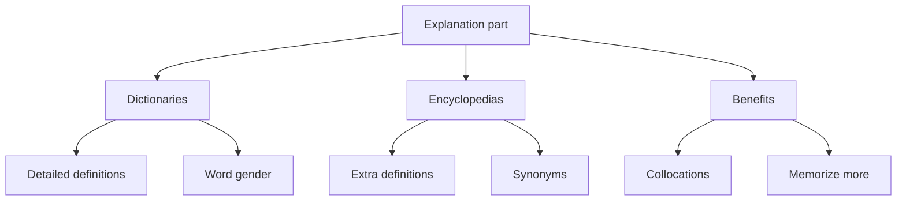

---

## 2. Saarland University 2

### STT 转录结果 / STT Transcript

> Now you have experienced the software we designed. We have a few questions for you. First, do you think the function of AI extracting knowledge points and adding them to the dictionary can help you study and review efficiently? Why? Firstly, I must say this feature is very powerful. That means I don't need really self-work to mark every word that I feel similar or unsimilar to me myself. That means AI can do it very efficiently and it can also adjust my way of studying and my knowledge standard to mark the words that I may potentially unfamiliar to it. It may help me focus more on the word and the text which I think will improve my learning feeling and also my knowledge standard.

### Agent 生成 JSON 导图 / Agent-Generated JSON Tree

**节点数 / Node count**: 8

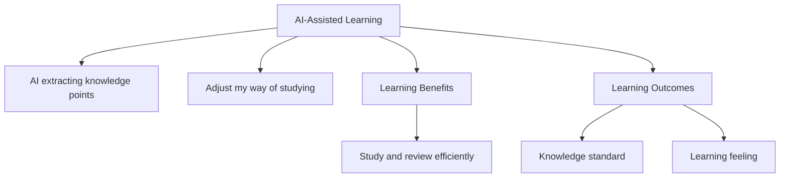

### 人类标注 JSON 导图 / Human-Annotated JSON Tree（来源 / Source: YQL）

**节点数 / Node count**: 11

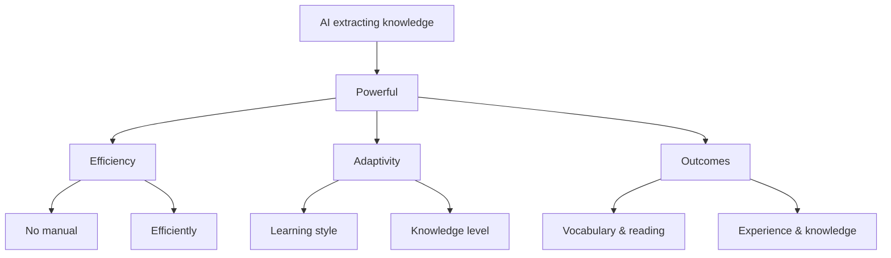

---

## 3. Saarland University 3

### STT 转录结果 / STT Transcript

> Do you think it saved your time? I think mostly it saved a lot of time for me because the computer and artificial intelligence can go through a passage very quickly and it can read a thousand even million words in one second. So it can of course do the marking of unfamiliar words in very short time and it will save a lot of time for me.

### Agent 生成 JSON 导图 / Agent-Generated JSON Tree

**节点数 / Node count**: 6

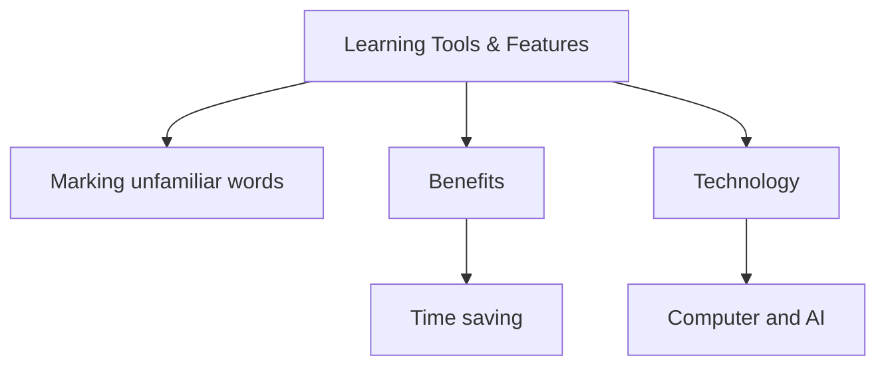

### 人类标注 JSON 导图 / Human-Annotated JSON Tree（来源 / Source: YQL）

**节点数 / Node count**: 5

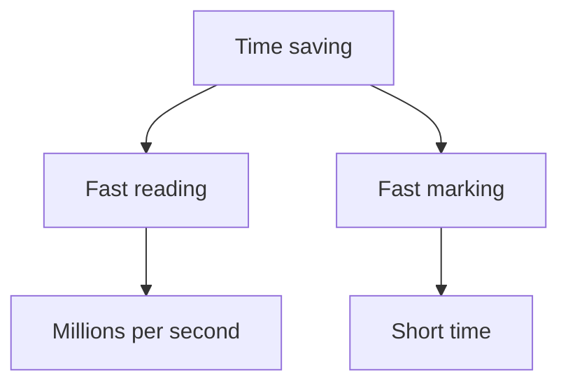

---

## 4. Saarland University 4

### STT 转录结果 / STT Transcript

> So how clear and useful do you think the progress reports of the quiz features are? I think this feature is pretty clear and very useful for me. Artificial intelligence can make reports on where I can improve my answer and on the point that I may ignore it or didn't pay attention when I learned it at the earlier time. The test can't really reflect my level but artificial intelligence can because it can analyze my real knowledge based on the daily usage and also this quiz. So this combination can reflect how good I've learned it and where I can improve it.

### Agent 生成 JSON 导图 / Agent-Generated JSON Tree

**节点数 / Node count**: 7

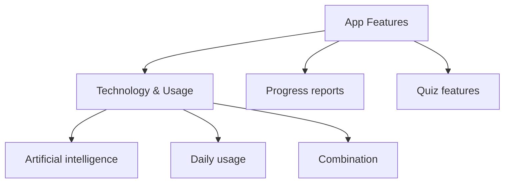

### 人类标注 JSON 导图 / Human-Annotated JSON Tree（来源 / Source: YQL）

**节点数 / Node count**: 7

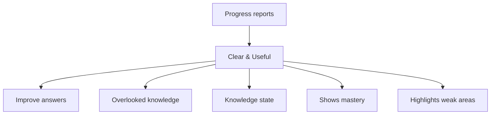

---

## 5. Saarland University 5

### STT 转录结果 / STT Transcript

> What features of this app do you find interesting or motivating you to learn? Is it something about design, the way makes learning feel rewarding or even just how easy it is to use? Could you share an example that stood out to you? I think it's very impressive to see that you've implemented a starring function so I can not only add a word to my own dictionary that I can review it as long as I want and also there will be a starring function that I can put a yellow star to it so it can make me pay attention to it maybe it is very difficult or maybe it's very useful in our daily life so which means it can just increase on how how I will focus on this word and it will make make my learning more efficiently and also I would like to point out that you you've done a very important function on calculating how much time I spent on the website because mostly I would just like to lie on the bed and look tiktok but now it can calculate how much time I spent on it so I would like to achieve every goal for my daily life like I would like to spend two hours on it and it can really calculate it and also what's more important is that it can show me a daily slogan that encouraged me keep on learning with it and without one sleeping.

### Agent 生成 JSON 导图 / Agent-Generated JSON Tree

**节点数 / Node count**: 6

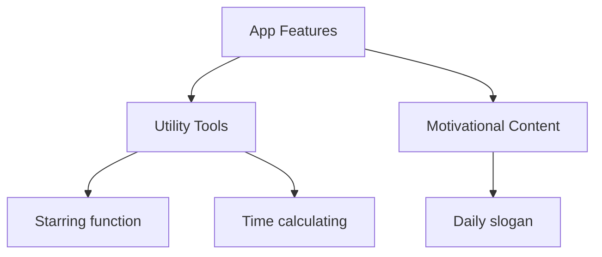

### 人类标注 JSON 导图 / Human-Annotated JSON Tree（来源 / Source: YQL）

**节点数 / Node count**: 10

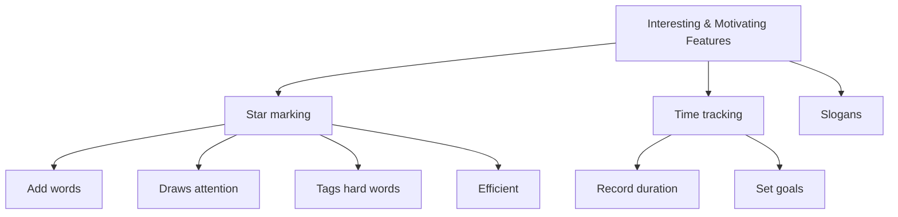

---

## 6. Saarland University 6

### STT 转录结果 / STT Transcript

> How would you describe your experience using the apps interface? Were there any aspects of the interface that you found confusing or intuitive? I think I will rate the interface of this application 8 out of 10 because it's very easy to find all the functions and they are very intuitive to me and I can easily find the functions or things I need without previous learning and the design is also for me very clear. Some details should be improved, I would say like the login interface there are some details you need to improve but that doesn't make my opinion worse I still think that the interface is very intuitive and not confusing at all.

### Agent 生成 JSON 导图 / Agent-Generated JSON Tree

**节点数 / Node count**: 6

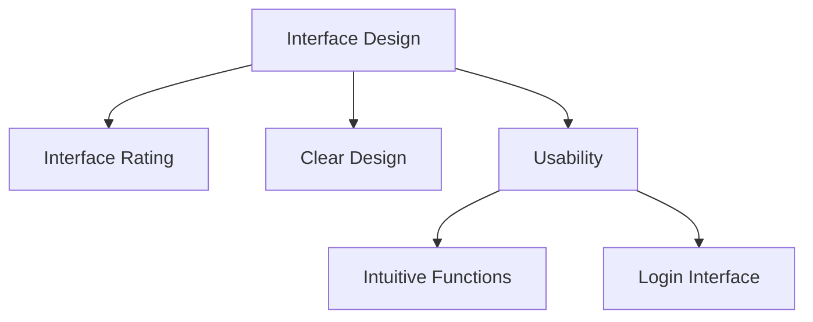

### 人类标注 JSON 导图 / Human-Annotated JSON Tree（来源 / Source: YQL）

**节点数 / Node count**: 11

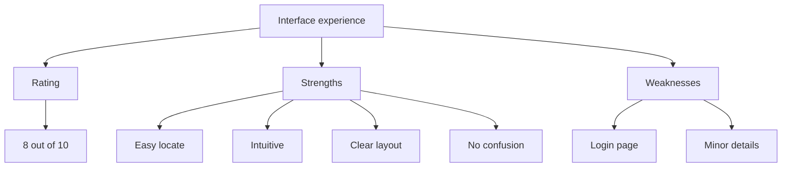

---

## 7. Saarland University 7

### STT 转录结果 / STT Transcript

> Did you encounter any errors while completing tasks in the app? If it is, what do you think caused these errors? How could we address them? I think the biggest problem I've encountered is in the quiz function. So the current version can't really look deep in my answer and rate very objective points to my answer because I would think that this version isn't really highly associated to AI like using AI to judge my answers or my thoughts. So I think if we want to address them, I would suggest you really use some APIs from AI and let AI consider in tests with some key messages you said. And it will make the review and the report clearer and more specific.

### Agent 生成 JSON 导图 / Agent-Generated JSON Tree

**节点数 / Node count**: 6

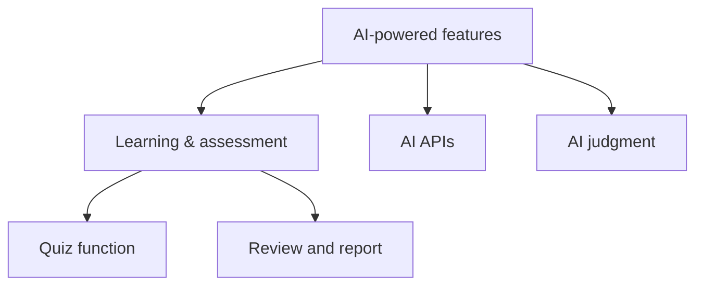

### 人类标注 JSON 导图 / Human-Annotated JSON Tree（来源 / Source: YQL）

**节点数 / Node count**: 10

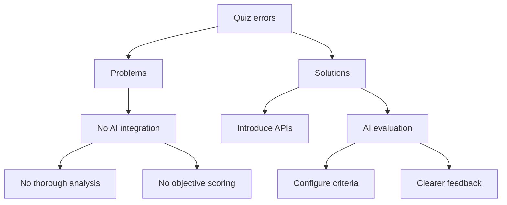

---

## 8. Saarland University 8

### STT 转录结果 / STT Transcript

> Are there any additional features you would like to see including the app? I think the current version is already enough for a very basic daily usage, but I would like to suggest if you can realize some AI-generated daily quiz, so it can help me to review the things I've learned yesterday, and also it can generate some questions that I may use tomorrow.

### Agent 生成 JSON 导图 / Agent-Generated JSON Tree

**节点数 / Node count**: 5

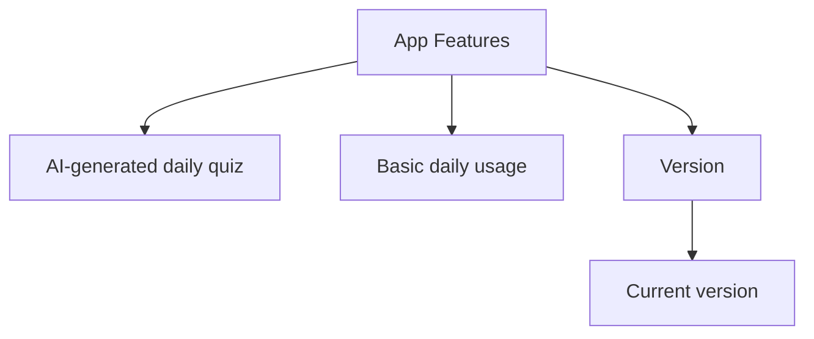

### 人类标注 JSON 导图 / Human-Annotated JSON Tree（来源 / Source: YQL）

**节点数 / Node count**: 7

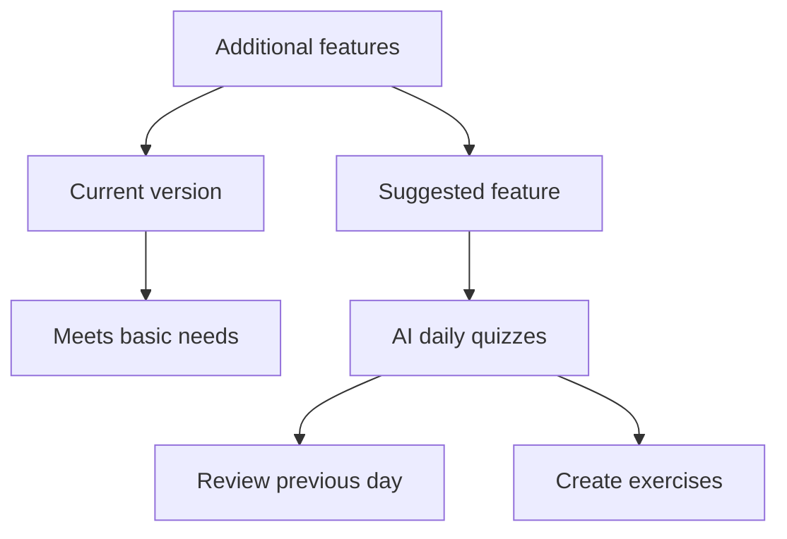

---

## 9. Saarland University 9

### STT 转录结果 / STT Transcript

> Is there anything else you'd like to share about your experience using the app? I think overall the app has a lot of potential and it offers some really useful features. However, one thing that stood out to me was how the interface could sometimes feel a bit overwhelming. Especially when there are too many options or icons on a single page, it took me a while to figure out how to navigate certain sections, like where to access my saved dictionary entries or progress app reports.

### Agent 生成 JSON 导图 / Agent-Generated JSON Tree

**节点数 / Node count**: 9

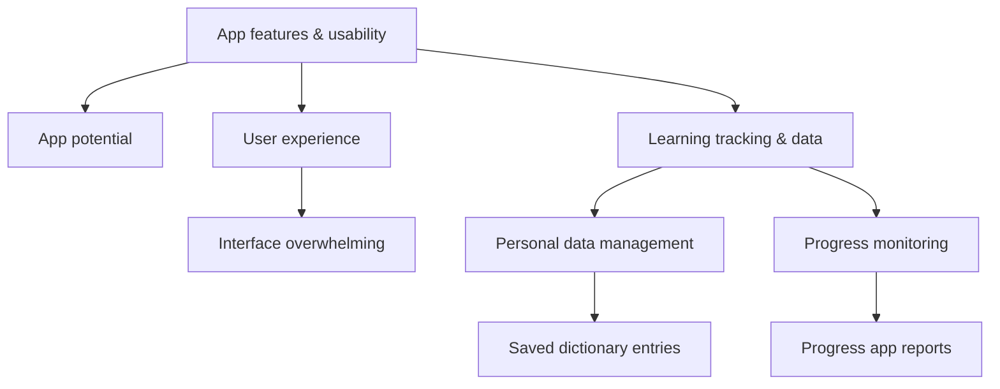

### 人类标注 JSON 导图 / Human-Annotated JSON Tree（来源 / Source: YQL）

**节点数 / Node count**: 13

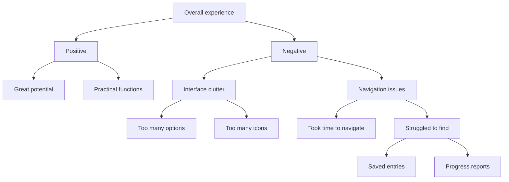

---
*三元组对比报告 / Triple Comparison Report — 20260818_131651*